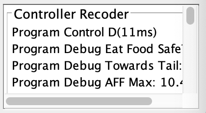

# Gluttonous Snake

### Problem Statement

$n$ is the size of the Game Map and $k$ is the length of the snake.

The following k lines contain two integers $(x_i, y_i)$ indicates the $ith$ position of the part of snakes.(which means the $1th$ part is the head and the $kth$ part is the tail).

Output an integer $d \in [0, 4)$indicates the next moving direction of the snake.

**Your output should end with a new line! (Which means you should output your answer like this : `printf("%d\n", ans);` Or `cout<<ans<<endl;`.**

The following code helps you map the [0, 4) to WSAD.

```java
public static final int dx[] = {-1, 1, 0, 0};
public static final int dy[] = {0, 0, -1, 1};
```

Additionally, the path of your controller program **should not** contain any space.

### Input Format(stdin)

$n~k$

$x_1~y_1$

$\cdots$

$x_k~y_k$

$x_{food} ~ y_{food}$


### Output Format(stdout)
$d$

### Debug
When you run `Program Ctrl Mode`, it'll provide you with an `input.txt` in the root directory. You can use it to debug offline.


Alsoe, you can output your debug information to `stderr` and they will appear in Controller Recoder.




### Sample Code

```cpp
#include <cstdio>
#include <cstring>
#include <algorithm>
#include <iostream>
#include <vector>
#include <queue>
#include <cstdlib>
#include <ctime>
#define PII pair<int, int>
#define PB(x) push_back(x)
#define MP(x, y) make_pair(x, y)
#define fi first
#define se second
using namespace std;

const int MAXN=50;
const int dx[] = {-1, 1, 0, 0};
const int dy[] = {0, 0, -1, 1};

int N, K;
bool mp[MAXN][MAXN];
vector<PII> snake;
PII food;

bool vis[MAXN][MAXN];
int from[MAXN][MAXN];
queue<PII> que;
inline void bfs(int x0, int y0){
	memset(vis, false, sizeof(vis));
	while(!que.empty()) que.pop();
	
	from[x0][y0]=-1, vis[x0][y0]=true, que.push(MP(x0, y0));
	while(!que.empty()){
		int x=que.front().fi, y=que.front().se; que.pop();
		for (int k=0; k<4; k++){
			int nx=x+dx[k], ny=y+dy[k];
			if (nx<1 || nx>N || ny<1 || ny>N) continue;
			if (mp[nx][ny]) continue;
			if (vis[nx][ny]) continue;
			from[nx][ny]=k, vis[nx][ny]=true, que.push(MP(nx, ny));
		}
	}
}

inline int getDirection(PII pos){
	if (!vis[pos.fi][pos.se]) return -1;
	int x=pos.fi, y=pos.se, ret=0;
	while(from[x][y]!=-1){
		ret=from[x][y];
		x-=dx[ret], y-=dy[ret];
	}
	return ret;
}


inline void init(){
	memset(mp, false, sizeof(mp));
}

inline void input(){
	scanf("%d%d", &N, &K);
	for (int i=0, x, y; i<K; i++) scanf("%d%d", &x, &y), snake.PB(MP(x, y));
	scanf("%d%d", &food.fi, &food.se);
}

int main(){
	init(), input();
	
	srand((unsigned)time(NULL));
	
	for (int i=0; i<K; i++) mp[snake[i].fi][snake[i].se]=true;
	mp[snake[K-1].fi][snake[K-1].se]=false;
	bfs(snake[0].fi, snake[0].se);
	int foodD=getDirection(food), tailD=getDirection(snake[K-1]);
	if (foodD>=0 && tailD>=0) printf("%d\n", foodD); else{
		if (tailD>=0) printf("%d\n", tailD); else{
			printf("%d\n", rand()%4);
		}
	}
	
	return 0;
}
```

### Requirements

* Jave Runtime Environment